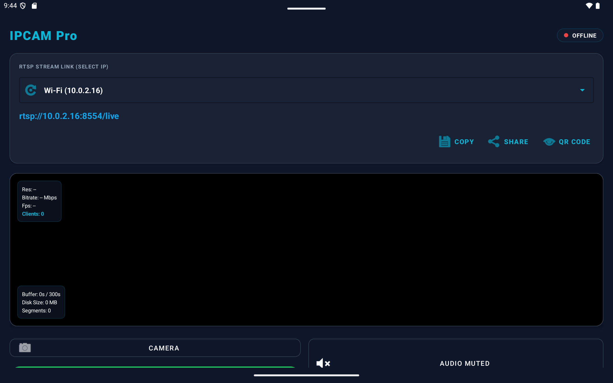
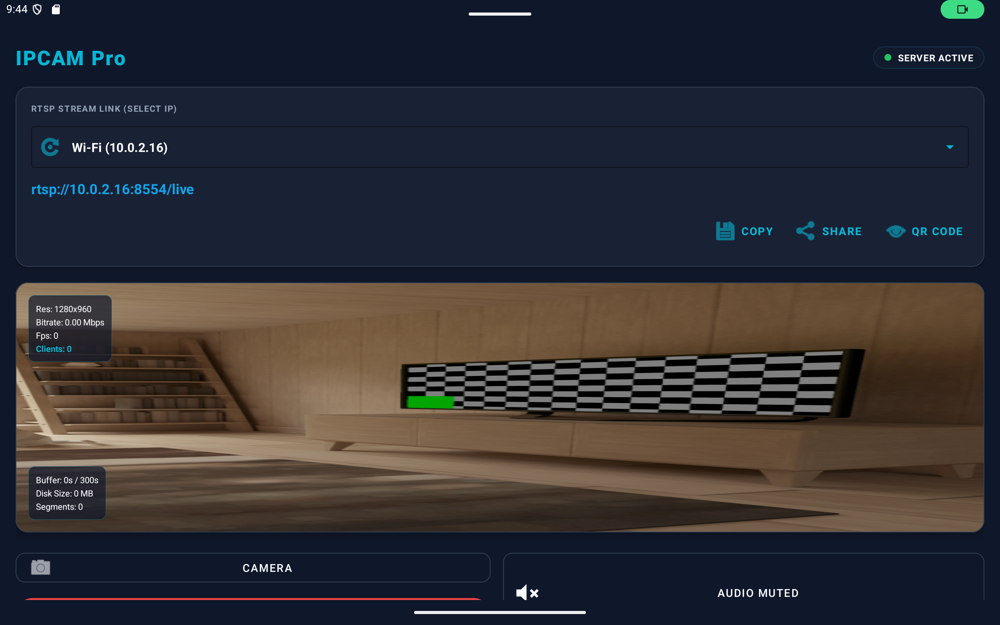
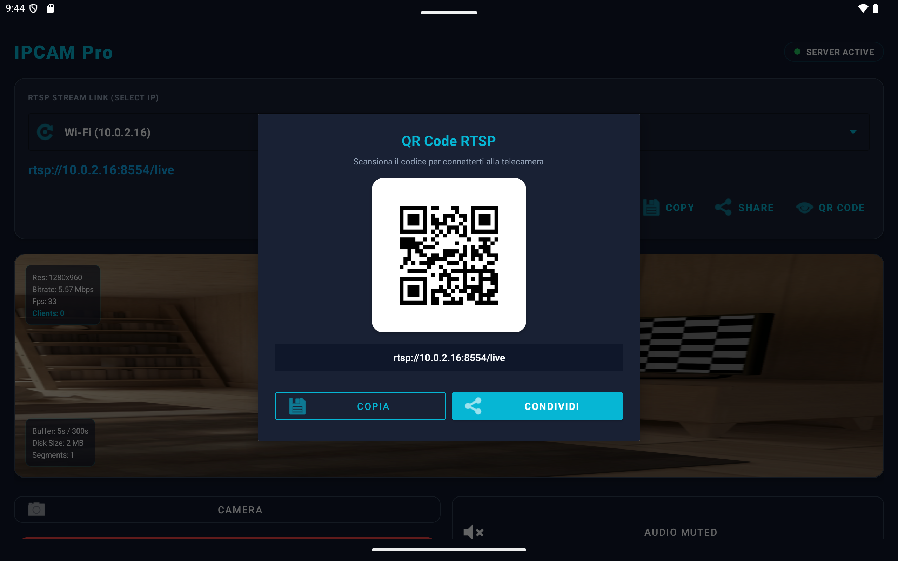

# IPCAM Pro 🎥📡

**IPCAM Pro** è un'applicazione Android nativa in Java che trasforma qualsiasi dispositivo Android (smartphone o tablet) in una **Telecamera IP RTSP ad alte prestazioni** con codifica hardware H.264 + AAC e registrazione locale in Replay Buffer ciclico.

Progetto GitHub: [m1rk0z/IPCAM](https://github.com/m1rk0z/IPCAM)

---

## 📱 Screenshots & Interfaccia Utente

| Interfaccia Principale (Cyber Teal) | Server Attivo & HUD Diagnostico | Connessione Rapida via QR Code |
| :---: | :---: | :---: |
|  |  |  |

---

## 🌟 Caratteristiche Principali (Key Features)

- **📡 Streaming RTSP a Bassa Latenza**:
  - Server RTSP integrato (RFC 2326) con porta personalizzabile (default: `8554`).
  - Supporto per **UDP Unicast** e **TCP Interleaved (RTP-over-RTSP)** per la massima stabilità di rete.
  - Formati supportati: Video **H.264** (RFC 6184 FU-A NAL units) e Audio **AAC** (RFC 3640 / RFC 6416).

- **🔄 Hot-Swapping Dinamico dei Parametri (Senza Disconnessione)**:
  - Cambio fotocamera (Frontale / Posteriore) in tempo reale.
  - Selezione Risoluzione: **4K (2160p)**, **1080p**, **720p** con fallback automatico di sicurezza in caso di limiti hardware/termici.
  - Configurazione FPS: **15, 30, 60, 120, 180 FPS** (in base alle capacità del sensore).
  - Selezione Bitrate (1 Mbps - 20 Mbps) con adattamento al volo tramite `MediaCodec.setParameters()`.
  - Rotazione dello stream live: **0°, 90°, 180°, 270°** senza distorsioni dell'aspect ratio e senza riavviare il server RTSP o disconnettere i client.

- **🎨 Interfaccia Grafica "Cyber Teal" (Soft UI Evolution)**:
  - Design scuro ad alto contrasto (sfondo slate `#0F172A`, superfici card `#192134`, accenti ciano `#06B6D4` ed arancione `#F97316`).
  - Compatibilità nativa **Android 15+ (targetSdk 36)** con gestione `fitsSystemWindows` e adattamento perfetto ai bordi dello schermo (Edge-to-Edge).

- **📲 Connessione Rapida via QR Code & Selezione IP**:
  - Riconoscimento automatico dell'indirizzo IP di rete (Wi-Fi, Hotspot AP, Ethernet).
  - Generazione dinamica di **QR Code** integrata (libreria ZXing) per la scansione rapida del link `rtsp://<IP>:<PORT>/live`.
  - Pulsanti rapidi per Copiare e Condividere il link di streaming.

- **📊 Overlay Diagnostico HUD in Tempo Reale**:
  - Pannello HUD trasparente fluttuante sopra l'anteprima video con rilevamento continuo di:
    - Risoluzione attiva.
    - Bitrate effettivo in Mbps.
    - Framerate reale (FPS).
    - Numero di client RTSP connessi contemporaneamente.

- **💾 Replay Buffer Locale (Registrazione Ciclica)**:
  - Salvataggio automatico di spezzoni `.mp4` da 5 secondi sincronizzati con i fotogrammi chiave (I-Frame).
  - Finestra ciclica configurabile fino a 300 secondi (5 minuti), con pulizia automatica dei file più vecchi per non sovraccaricare la memoria del dispositivo.

---

## 🏗️ Architettura del Codice

```
app/src/main/java/com/example/ipcam/
├── MainActivity.java               # Controller dell'interfaccia utente e gestione dei binding
├── StreamingForegroundService.java # Foreground Service coordinatore di tutti i moduli
├── CameraCaptureManager.java       # Gestore Camera2 API (doppio output: Preview + Encoder)
├── VideoEncoderManager.java        # Encoder hardware H.264 (MediaCodec)
├── AudioCaptureManager.java        # Cattura AudioRecord + Encoder AAC (MediaCodec)
├── RtspServerManager.java          # Server RTSP puro in Java (TCP/UDP, RTP packetizer)
├── SegmentBufferManager.java       # Gestore del Replay Buffer con MediaMuxer e pulizia ciclica
├── SettingsRepository.java         # Persistenza delle preferenze utente (SharedPreferences)
└── NetworkInfoHelper.java          # Rilevamento indirizzi IP di rete (Wi-Fi/AP)
```

---

## 🚀 Guida all'Uso e Connessione Client

### 1. Avvio dello Streaming nell'App
1. Apri **IPCAM Pro** sul dispositivo Android.
2. Scegli l'indirizzo IP desiderato (es. Wi-Fi locale o Hotspot).
3. Imposta la Risoluzione, gli FPS, il Bitrate e la Rotazione desiderati.
4. Premi **START LIVE**. L'indicatore di stato diventerà verde (**SERVER ACTIVE**).

### 2. Connessione tramite VLC Media Player
1. Apri **VLC Media Player**.
2. Vai su **Media > Apri flusso di rete...** (oppure premi `Ctrl+N`).
3. Inserisci l'URL mostrato nell'app o scansiona il **QR Code**:
   ```text
   rtsp://<IP-DISPOSITIVO>:8554/live
   ```
4. Fai clic su **Riproduci**.

### 3. Connessione tramite FFmpeg / OBS Studio
Per lo streaming in OBS Studio o tramite riga di comando FFmpeg:
```bash
ffmpeg -rtsp_transport tcp -i rtsp://<IP-DISPOSITIVO>:8554/live -c copy output.mp4
```

---

## 🛠️ Compilazione e Build del Progetto

### Requisiti
- **Android SDK**: `compileSdk = 36`, `minSdk = 31`, `targetSdk = 36`
- **Java**: Java 11
- **Gradle**: Wrapper Gradle incluso nel progetto

### Comandi di Compilazione
```powershell
# Compila l'APK di Debug
.\gradlew.bat assembleDebug

# Compila l'APK di Release (Firmato)
.\gradlew.bat assembleRelease

# Pulisci i file di build
.\gradlew.bat clean
```

L'APK compilato di release si trova in:
`app/build/outputs/apk/release/app-release.apk`

---

## 🔄 Come Aggiornare il Repository GitHub

Per aggiornare il repository GitHub (`m1rk0z/IPCAM`) con il codice corrente, i nuovi screenshot ed il file README:

```powershell
# 1. Verifica lo stato dei file
git status

# 2. Aggiungi tutte le modifiche e i nuovi screenshot
git add .

# 3. Crea un commit per la nuova versione
git commit -m "Add app screenshots to README and update documentation"

# 4. Invia le modifiche su GitHub
git push origin main
```

---

## 📄 Licenza
Rilasciato sotto licenza MIT / Open Source. Sviluppato per prestazioni elevate in ambiente Android.
